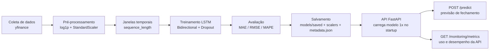

# 📈 Tech Challenge Fase 4 — Previsão de Preços de Ações com Deep Learning


## 📌 Sobre o Projeto

Este projeto foi desenvolvido como parte do **Tech Challenge – Fase 4** da Pós-Tech em Machine Learning Engineering.

O objetivo consiste em construir uma solução completa para previsão do preço de fechamento de ações utilizando redes neurais recorrentes (**Long Short-Term Memory – LSTM**), contemplando todo o ciclo de desenvolvimento de um sistema de Machine Learning, desde a coleta dos dados históricos até a disponibilização do modelo em produção através de uma API REST.

Diferentemente de um notebook exclusivamente voltado para experimentação, este projeto implementa uma pipeline completa de Machine Learning Engineering, incluindo:

- coleta automática dos dados;
- análise exploratória;
- pré-processamento;
- busca e ajuste de hiperparâmetros;
- treinamento;
- avaliação;
- persistência do modelo;
- API de inferência;
- dashboard de monitoramento.

---

# 🎯 Objetivos

O projeto busca atender às seguintes etapas do ciclo de vida de um modelo de Machine Learning:

- Coletar automaticamente dados históricos de ações;
- Realizar análise exploratória dos dados (EDA);
- Construir uma pipeline de pré-processamento sem data leakage;
- Treinar uma rede neural LSTM para previsão do preço de fechamento;
- Avaliar o modelo utilizando métricas de regressão;
- Exportar o modelo para produção;
- Disponibilizar uma API REST utilizando FastAPI;
- Disponibilizar dashboard para monitoramento das predições.

---

# 🏗 Arquitetura Geral

O fluxo completo do projeto pode ser resumido conforme o diagrama abaixo.

```

Yahoo Finance

↓

Coleta dos dados

↓

Análise Exploratória (EDA)

↓

Pré-processamento

• log1p

• StandardScaler

↓

Construção das Sequências

↓

Bidirectional LSTM

↓

Avaliação

↓

Exportação

(modelo + scaler)

↓

FastAPI

↓

Dashboard Streamlit

```

Todo o pipeline de inferência utilizado pela API reproduz exatamente o fluxo utilizado durante o treinamento, garantindo consistência entre ambiente de desenvolvimento e produção.

---

# 📂 Estrutura do Projeto

```

mle_tech_challenge_4/

├── app.py
├── app/
│   ├── __init__.py
│   └── static/
│       ├── index.html
│       └── assets/
│           ├── index-DJh4hmGh.js
│           └── index-DsDejwUj.css
├── artifacts/
│   ├── modelo_lstm.keras
│   └── scaler.pkl
├── docs/
│   ├── documentacao_lstm_tech_challenge.md
│   ├── oquefazer.md
│   └── Pos_Tech - MLET - Tech Challenge Fase 4.pdf
├── imgs/
├── modelagem/
│   └── fase4_MLET.ipynb
├── README.md
├── requirements copy.txt
├── requirements-dev.txt
└── requirements.txt

```

---

# 📊 Base de Dados

Os dados históricos são obtidos diretamente do **Yahoo Finance**, utilizando a biblioteca **yfinance**.

Neste projeto foi utilizado o ativo:

**Ticker:** BBD (Banco Bradesco ADR — NYSE)

Período analisado:

**Junho de 2020 até Junho de 2026**

---

# 📈 Variáveis Utilizadas

O modelo utiliza apenas informações históricas do próprio ativo.

| Feature | Descrição |
|----------|-----------|
| Open | Preço de abertura |
| High | Maior preço do dia |
| Low | Menor preço do dia |
| Close | Preço de fechamento |
| Volume | Volume negociado |

O alvo do modelo consiste em prever o **preço de fechamento do próximo pregão**.

---

# 📊 Análise Exploratória

Foi realizada uma análise exploratória completa da série temporal antes do treinamento.

As principais etapas foram:

- análise da série histórica;
- histogramas;
- boxplots;
- estatísticas descritivas;
- identificação de assimetria;
- análise de outliers.

A análise mostrou que:

- as distribuições apresentavam forte assimetria positiva;
- o Volume possuía cauda longa;
- não foram encontrados outliers relevantes pelo método IQR;
- as oscilações observadas representam regimes naturais do mercado e não erros de coleta.

Dessa forma, optou-se por manter todos os registros da série temporal.

---

# ⚙️ Pipeline de Pré-processamento

Após a análise exploratória foi definida a seguinte estratégia de pré-processamento.

## 1. Transformação Logarítmica

Todas as variáveis OHLCV recebem:

```python
np.log1p()
```

Essa transformação reduz a assimetria das distribuições e melhora a estabilidade do treinamento.

---

## 2. Normalização

Após a transformação logarítmica é aplicado um:

```python
StandardScaler
```

O scaler é ajustado **exclusivamente no conjunto de treinamento**.

Posteriormente os conjuntos de validação, teste e produção utilizam apenas:

```python
transform()
```

garantindo ausência de data leakage.

---

## 3. Divisão Temporal

Os dados são divididos cronologicamente em:

| Conjunto | Percentual |
|-----------|-----------:|
| Treino | 70% |
| Validação | 15% |
| Teste | 15% |

Não é realizado embaralhamento dos dados (shuffle), preservando a ordem temporal da série.

---

## 4. Construção das Sequências

As entradas da rede são construídas utilizando janelas deslizantes.

Cada amostra possui:

- 30 dias de histórico;
- 5 variáveis por dia.

Assim, cada entrada possui dimensão:

```

(30,5)

```

Enquanto o alvo corresponde ao preço de fechamento do dia imediatamente seguinte.

---
# 🧠 Modelagem

Todo o processo de modelagem foi desenvolvido no notebook `fase4_MLET.ipynb`, contemplando desde a definição da arquitetura da rede neural até a avaliação do modelo em um conjunto de teste completamente isolado.

O objetivo do modelo consiste em prever o **preço de fechamento do próximo pregão**, utilizando como entrada uma sequência histórica dos últimos 30 pregões.

A estratégia adotada buscou equilibrar capacidade preditiva e generalização, evitando overfitting e vazamento de informação ao longo de todo o pipeline.

---

# 🔎 Busca de Hiperparâmetros

Como etapa inicial, foi realizada uma busca sistemática de hiperparâmetros utilizando **Grid Search** aliado ao **TimeSeriesSplit**, técnica apropriada para séries temporais.

Diferentemente do K-Fold tradicional, o TimeSeriesSplit preserva a ordem cronológica dos dados, garantindo que cada conjunto de validação contenha apenas observações posteriores ao conjunto de treinamento.

Foram avaliadas combinações envolvendo:

| Hiperparâmetro | Valores avaliados |
|----------------|-------------------|
| Look Back | 30, 60 e 90 dias |
| Número de neurônios | 64, 128 e 256 |
| Dropout | 0.10, 0.20 e 0.30 |
| Batch Size | 16 e 32 |

Ao todo foram avaliadas **108 combinações**, utilizando validação temporal em cinco folds.

Essa etapa teve como objetivo restringir o espaço de busca e identificar configurações promissoras para o treinamento do modelo.

---

# 🎯 Seleção Final dos Hiperparâmetros

Embora o Grid Search tenha fornecido uma boa aproximação dos melhores parâmetros, observou-se que pequenas alterações produziam modelos com maior estabilidade durante o treinamento e melhor capacidade de generalização.

Assim, a configuração final foi definida manualmente após análise conjunta de:

- curvas de aprendizado;
- comportamento da validação;
- estabilidade do treinamento;
- capacidade de generalização;
- desempenho obtido no conjunto de teste.

Os hiperparâmetros utilizados na versão final do modelo foram:

| Hiperparâmetro | Valor |
|----------------|------:|
| Look Back | **30 dias** |
| Units | **128** |
| Dropout | **0.30** |
| Batch Size | **16** |
| Optimizer | Adam |
| Learning Rate | 1×10⁻⁴ |
| Loss Function | MAE |

Essa configuração apresentou o melhor equilíbrio entre erro de previsão e estabilidade durante o treinamento.

---

# 🏗 Arquitetura da Rede Neural

O modelo utiliza uma arquitetura baseada em **Bidirectional Long Short-Term Memory (BiLSTM)**.

As redes LSTM são especialmente indicadas para séries temporais por conseguirem aprender dependências de longo prazo, enquanto a versão bidirecional melhora a qualidade da representação aprendida durante o treinamento.

Além da LSTM, foram utilizadas técnicas adicionais de regularização para reduzir overfitting.

A arquitetura final pode ser representada da seguinte forma:

```
Entrada
(30 dias × 5 variáveis)

        │

        ▼

Bidirectional LSTM
128 neurônios
(return_sequences=True)

        │

BatchNormalization

        │

Dropout (0.30)

        │

LSTM
64 neurônios

        │

BatchNormalization

        │

Dropout (0.30)

        │

Dense (16)
ReLU

        │

Dropout (0.05)

        │

Dense (1)

        │

Preço previsto
```

---

# 🛡 Estratégias de Regularização

Para melhorar a capacidade de generalização foram utilizadas diferentes técnicas de regularização.

## Batch Normalization

Aplicada após cada camada recorrente para estabilizar a distribuição das ativações durante o treinamento.

Benefícios:

- treinamento mais estável;
- convergência mais rápida;
- redução da sensibilidade ao learning rate.

---

## Dropout

Foi utilizado Dropout em diferentes pontos da arquitetura para reduzir a dependência entre neurônios e minimizar overfitting.

A taxa escolhida foi:

```
0.30
```

nas camadas recorrentes.

---

## Regularização L2

As camadas LSTM utilizam penalização L2 sobre os pesos da rede.

Essa estratégia reduz o crescimento excessivo dos parâmetros durante o treinamento e melhora a capacidade de generalização.

---

# ⚙ Processo de Treinamento

O treinamento foi realizado utilizando o otimizador **Adam**, amplamente empregado em problemas de Deep Learning devido à sua estabilidade e rápida convergência.

Configuração utilizada:

| Parâmetro | Valor |
|------------|------:|
| Optimizer | Adam |
| Learning Rate | 0.0001 |
| Loss | MAE |
| Batch Size | 16 |

O treinamento foi monitorado continuamente utilizando métricas calculadas na escala original do problema.

---

# 🔄 Callbacks

Para tornar o treinamento mais eficiente foram utilizados quatro callbacks principais.

## EarlyStopping

Interrompe automaticamente o treinamento quando não há melhoria significativa na métrica monitorada.

Benefícios:

- evita overfitting;
- reduz tempo de treinamento;
- restaura automaticamente os melhores pesos.

---

## ReduceLROnPlateau

Quando o treinamento atinge um platô, o learning rate é reduzido automaticamente.

Essa estratégia melhora o refinamento da solução nas últimas épocas.

---

## ModelCheckpoint

Salva automaticamente o melhor modelo encontrado durante o treinamento.

O arquivo exportado é:

```
modelo_lstm.keras
```

---

## RealMapeCallback

Foi implementado um callback personalizado responsável por calcular o MAPE na escala original dos preços.

A cada época o callback realiza automaticamente:

- inverse_transform do StandardScaler;
- aplicação de expm1;
- cálculo do MAPE em USD.

Dessa forma, todas as decisões de treinamento são tomadas utilizando uma métrica diretamente interpretável pelo negócio.

---

# 📈 Curvas de Aprendizado

Durante o treinamento foram monitoradas duas métricas principais:

- Loss (MAE normalizado);
- MAPE em escala real.

As curvas obtidas indicaram:

- convergência estável;
- ausência de overfitting severo;
- boa capacidade de generalização;
- redução consistente do erro ao longo das épocas.

O EarlyStopping interrompeu o treinamento automaticamente quando não havia mais ganho significativo de desempenho.

---

# 📊 Avaliação do Modelo

Após o treinamento, o modelo foi avaliado em um conjunto de teste completamente isolado, nunca utilizado durante o ajuste dos pesos ou dos hiperparâmetros.

As métricas foram calculadas na escala original (USD).

| Métrica | Resultado |
|----------|----------:|
| MAE | **0.0297 USD** |
| RMSE | **0.0386 USD** |
| MAPE | **1.94%** |
| Acurácia Direcional | **40.31%** |

O baixo valor de MAPE indica que o modelo apresenta elevada precisão na previsão do preço de fechamento do ativo.

---

# 📉 Análise dos Resultados

A análise visual das previsões mostrou que o modelo consegue acompanhar adequadamente a tendência geral da série temporal.

Observou-se que:

- o modelo acompanha bem movimentos de médio prazo;
- erros maiores concentram-se em períodos de alta volatilidade;
- ocorre pequena defasagem em pontos de reversão abrupta, comportamento esperado em modelos autoregressivos baseados em LSTM.

O gráfico de dispersão entre valores reais e previstos apresentou forte correlação linear, indicando boa capacidade preditiva.

---

# 🚶 Walk-Forward Validation

Além da divisão tradicional entre treino, validação e teste, foi implementada uma estratégia de **Walk-Forward Validation**.

Nessa abordagem o modelo é avaliado em múltiplas janelas temporais sucessivas, simulando o comportamento encontrado em ambiente de produção.

Embora a implementação esteja presente no notebook, a execução completa não foi finalizada durante os experimentos devido ao elevado tempo computacional.

Ainda assim, a estrutura permanece disponível para futuras reavaliações do modelo.

---

# 💾 Exportação do Modelo

Após o treinamento são persistidos dois artefatos fundamentais:

```
modelo_lstm.keras
```

Modelo treinado contendo arquitetura e pesos.

```
scaler.pkl
```

Objeto `StandardScaler` utilizado durante o treinamento.

A API utiliza exatamente esses mesmos artefatos durante a inferência, garantindo que o pipeline de produção seja idêntico ao utilizado no desenvolvimento do modelo.

---

# ⚙️ API — Servindo o Modelo em Produção

Os artefatos `modelo_lstm.keras` e `scaler.pkl` descritos acima são consumidos por uma **API RESTful construída com FastAPI**, responsável por carregar o modelo uma única vez na inicialização (sem recarregar a cada request) e servir previsões em tempo real via `/predict`, além de expor coleta de dados, retreinamento, métricas e monitoramento básico de uso.

## Organização do Backend

```
app/                     # Camada de API (FastAPI)
├── app.py               # Instancia o FastAPI, middlewares, lifespan, routers
├── settings.py          # Configuração via pydantic-settings (app/.env)
├── dependencies.py      # Depends (sessão de banco)
├── routers/             # health, model, data, predict, ml, monitoring, home, nolog, log
├── services/            # model_service, data_service, monitoring_service, ml, log
└── models/              # Schemas Pydantic (predict.py, stock.py) + ORM ApiLog (logs.py)
ml/                       # Pipeline de ML reaproveitada por API e scripts/
├── data.py               # Coleta/validação via yfinance
├── preprocessing.py      # log1p, StandardScaler, split temporal, janelas (sequence_length)
├── model.py              # Arquitetura LSTM, treino, avaliação (MAE/RMSE/MAPE)
└── inference.py          # StockForecastService — carrega modelo 1x, prevê N dias à frente
scripts/                  # CLIs finas sobre ml/ (rodar fora da API)
├── collect_data.py
├── train_model.py
└── evaluate_model.py
models/
├── saved/lstm_v1.keras         # Modelo LSTM v1 (BBD) já treinado — entregue com o projeto
├── scalers/lstm_v1_scaler.pkl
└── metadata.json               # Metadados + métricas do modelo atualmente carregado
tests/                    # pytest + TestClient
Dockerfile / docker-compose.yml / .dockerignore
```

### Pipeline de ponta a ponta



---

# 🚀 Executando o Projeto

## Instalação

```bash
git clone <repo-url>
cd mle_tech_chalenge_4
python -m venv .venv
source .venv/bin/activate            # Windows: .venv\Scripts\activate
pip install -r requirements-dev.txt  # inclui requirements.txt + pytest + notebook
```

## Rodar localmente

```bash
uvicorn app.app:app --reload --host 0.0.0.0 --port 8000
```

- Swagger UI: http://localhost:8000/docs
- ReDoc: http://localhost:8000/redoc
- Landing page: http://localhost:8000/

O projeto já é entregue com o modelo v1 (BBD) treinado em `models/saved/lstm_v1.keras` — a API carrega esse modelo automaticamente no startup, sem precisar treinar antes de usar `/predict`.

## Treinar um novo modelo

### Via linha de comando
```bash
python scripts/collect_data.py --symbol BBD --start 2020-06-01 --end 2026-06-01
python scripts/train_model.py --symbol BBD --start 2020-06-01 --end 2026-06-01 \
    --sequence-length 30 --epochs 100 --batch-size 16
python scripts/evaluate_model.py
```

### Via API
```bash
curl -X POST http://localhost:8000/api/v1/model/train \
  -H "Content-Type: application/json" \
  -d '{
        "symbol": "AAPL",
        "start_date": "2019-01-01",
        "end_date": "2024-07-20",
        "sequence_length": 30,
        "epochs": 50,
        "batch_size": 32
      }'
```
O treino roda de forma síncrona (a request fica bloqueada até terminar) — para poucas épocas em um único ticker isso é aceitável no escopo deste projeto; para treinos maiores, prefira o script de linha de comando. Ao terminar, o novo modelo substitui o modelo em uso pela API (recarregado automaticamente) e vira a nova versão consultável em `/model/info`.

## Docker

```bash
docker compose up --build
# ou
docker build -t stock-lstm-forecast-api .
docker run -p 8000:8000 stock-lstm-forecast-api
```

A imagem já inclui o modelo v1 pré-treinado (`models/`), então `/predict` funciona imediatamente após o container subir.

---

# 📡 Endpoints da API

Todos sob o prefixo `/api/v1`.

## `GET /health`
Status da API, se o modelo está carregado, versão do modelo, hora atual e ambiente.
```json
{
  "status": "ok",
  "model_loaded": true,
  "model_version": "1.0.0",
  "current_time": "2026-07-07T04:00:00+00:00",
  "environment": "development"
}
```

## `GET /model/info`
Metadados do modelo atualmente carregado.
```json
{
  "model_name": "lstm_v1",
  "model_type": "LSTM",
  "symbol": "BBD",
  "data_start_date": "2020-06-01",
  "data_end_date": "2026-06-01",
  "sequence_length": 30,
  "features": ["Close", "High", "Low", "Open", "Volume"],
  "metrics": {"mae": 0.0297, "rmse": 0.0386, "mape": 1.94, "directional_accuracy": 40.31},
  "trained_at": "2026-06-27",
  "model_path": "models/saved/lstm_v1.keras",
  "model_version": "1.0.0"
}
```

## `GET /model/metrics`
MAE, RMSE, MAPE, acurácia direcional, loss final/validação e tamanho do dataset usado.

## `POST /data/collect`
Coleta dados históricos via yfinance e salva em `data/raw/`.
```bash
curl -X POST http://localhost:8000/api/v1/data/collect \
  -H "Content-Type: application/json" \
  -d '{"symbol": "AAPL", "start_date": "2018-01-01", "end_date": "2024-07-20"}'
```
Retorna 422 para ticker inválido, datas inválidas/invertidas ou ausência de dados.

## `POST /model/train`
Coleta (se necessário), pré-processa, treina, avalia e salva um novo modelo. Ver seção "Treinar um novo modelo" acima para o payload completo.

## `POST /predict` — endpoint principal
**Opção A — por ticker** (a API busca os dados mais recentes via yfinance):
```bash
curl -X POST http://localhost:8000/api/v1/predict \
  -H "Content-Type: application/json" \
  -d '{"symbol": "BBD", "days_ahead": 1}'
```
```json
{
  "symbol": "BBD",
  "last_known_date": "2026-07-06",
  "prediction_date": "2026-07-07",
  "predicted_close": 3.3849,
  "days_ahead": 1,
  "model_version": "1.0.0",
  "sequence_length": 30,
  "predictions": [{"date": "2026-07-07", "predicted_close": 3.3849}]
}
```

**Opção B — dados históricos fornecidos pelo cliente**:
```bash
curl -X POST http://localhost:8000/api/v1/predict \
  -H "Content-Type: application/json" \
  -d '{
        "historical_data": [
          {"date": "2024-07-01", "close": 3.20},
          {"date": "2024-07-02", "close": 3.22}
          /* ... pelo menos sequence_length (30) pontos, em ordem */
        ],
        "days_ahead": 1
      }'
```

Erros tratados: `422` para payload inválido (nem `symbol` nem `historical_data`, ou os dois juntos), `422` para menos pontos que `sequence_length`, `503` se nenhum modelo estiver carregado.

## `GET /ml/features`
Metadados das features usadas pelo modelo (nomes, `sequence_length`, tipo de scaler) e uma amostra dos dados brutos e pré-processados mais recentes.

## `GET /monitoring/metrics`
Reaproveita a tabela de logs (`ApiLog`, já preenchida por um middleware genérico de logging estruturado): total de chamadas, tempo médio de resposta, contagem por status HTTP e últimas predições (sem expor payloads/dados sensíveis).

---

# ✅ Testes

```bash
pytest -v
pytest --cov=app --cov=ml --cov-report=term-missing
```

20 testes cobrindo: health, model/info (+ 503 sem modelo), predict (payload inválido, dados insuficientes para `sequence_length`, modelo não carregado, opção B e um teste de integração real via yfinance), data/collect (datas/ticker inválidos e coleta válida), ml/features e monitoring/metrics. Os testes de coleta/predição por símbolo fazem chamadas reais à yfinance e precisam de acesso à internet.

---

# ⚠️ Limitações da API

Além das limitações do modelo já discutidas (volatilidade, defasagem em reversões abruptas, Walk-Forward incompleto), a camada de API tem as seguintes limitações conhecidas:

1. **`days_ahead > 1` usa forecasting recursivo**: o modelo só foi treinado para prever t+1. Para prever vários dias, a API realimenta a própria previsão como entrada do passo seguinte (aproximando High/Low/Open pelo Close previsto e mantendo o último Volume conhecido). É uma previsão real — passa pelo modelo a cada passo —, mas o erro acumula a cada dia adicional.
2. **Opção B do `/predict` assume a mesma escala/ativo do treino**: como o `StandardScaler` foi ajustado especificamente para a faixa de preços do BBD (~US$ 1,70–4,00 em log1p), enviar uma série histórica de um ativo com preços em escala muito diferente (ex.: uma ação de R$200) produz previsões sem sentido. Para prever outro ativo/escala, treine um novo modelo primeiro via `POST /model/train` com esse símbolo.
3. **Colunas High/Low/Open/Volume aproximadas na opção B**: se o cliente só fornece `date`+`close`, a API aproxima `High=Low=Open=Close` e usa o volume típico do treino (salvo em `metadata.json`) — documentado aqui, não escondido como mock.
4. **Treino síncrono**: `POST /model/train` bloqueia a request até o treino terminar (sem fila de jobs). Aceitável para o escopo do projeto; para treinos longos, use `scripts/train_model.py`.
5. **Sem deploy em nuvem ainda** — ver seção abaixo.

---

# 🚢 Deploy

Ainda não há deploy em produção para este repositório. O projeto está pronto para deploy (Dockerfile funcional, variáveis de ambiente documentadas) em qualquer serviço que rode containers (Render, Railway, Fly.io, etc.). Passos sugeridos no Render.com:
1. Criar um *Web Service* apontando para este repositório, runtime Docker.
2. Variável de ambiente `ENVIRONMENT=production`.
3. Porta exposta: `8000`.

Depois de deployado, atualizar esta seção com a URL pública.

---

# 🔧 Variáveis de Ambiente

Definidas em `app/.env` (lidas via `pydantic-settings`):

| Variável | Padrão | Descrição |
|---|---|---|
| `ENVIRONMENT` | `development` | Refletido em `GET /health` (`development`/`production`) |

Nenhuma credencial é necessária — a API não exige autenticação.

---

# 🎬 Roteiro Sugerido para o Vídeo de Apresentação

1. Contexto do desafio (30s): Tech Challenge Fase 4, objetivo de prever fechamento de ações com LSTM.
2. Modelagem (1-2min): mostrar o notebook com EDA, busca de hiperparâmetros e curvas de aprendizado (seções acima).
3. Arquitetura da API (1min): estrutura de pastas (`ml/`, `app/`, `scripts/`, `models/`) e o diagrama da pipeline.
4. Métricas (30s): mostrar `models/metadata.json` e `GET /model/metrics`.
5. API em ação (2min): subir com `uvicorn`, abrir o Swagger, chamar `/health`, `/model/info`, `/predict` (opção A e B) e `/monitoring/metrics` ao vivo.
6. Docker (30s): `docker compose up --build` e repetir uma chamada.
7. Limitações e próximos passos (30s): recursão em `days_ahead`, deploy pendente.

---

# 🔮 Possíveis Melhorias Futuras

- Fila assíncrona de treino (Celery/RQ) para não bloquear a API em treinos longos.
- Suporte a múltiplos modelos carregados simultaneamente (um por ticker).
- Re-treino automático agendado (cron) com comparação de métricas antes de promover um novo modelo.
- Métricas de observabilidade (Prometheus/Grafana) além do `/monitoring/metrics` atual.
- Autenticação/rate limiting caso a API deixe de ser só para fins acadêmicos.