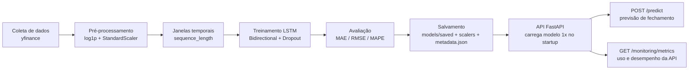

    

# 📈 Tech Challenge Fase 4 — API de Previsão de Fechamento de Ações (LSTM)

## Descrição

Projeto da Fase 4 da Pós Tech em Machine Learning Engineering (MLET). O desafio: criar
um modelo de rede neural **LSTM (Long Short-Term Memory)** para prever o preço de
fechamento de uma ação e disponibilizar essa previsão através de uma **API RESTful**,
cobrindo toda a pipeline — coleta de dados, pré-processamento, treinamento, avaliação,
salvamento do modelo e deploy.

Este repositório reaproveita a arquitetura de API (FastAPI + SQLAlchemy + routers/services)
construída no Tech Challenge Fase 1 (API de consulta de livros), adaptada para o domínio de
séries temporais financeiras. O código de scraping/livros/autenticação foi removido; o que
sobrou foi o esqueleto de API (middleware de log estruturado, tratamento de erros, padrão de
routers/services, testes com `pytest` + `TestClient`).

**Ticker oficial do projeto: `BBD`** (Bradesco, ADR negociado na NYSE, cotado em USD).

## Objetivo

Prever o preço de fechamento (`Close`) de uma ação a partir de uma janela de preços
históricos, usando um modelo LSTM bidirecional treinado sobre dados reais coletados via
[yfinance](https://pypi.org/project/yfinance/).

## Arquitetura da solução

```
mle_tech_chalenge_4/
├── app/                     # Camada de API (FastAPI)
│   ├── app.py               # Instancia o FastAPI, middlewares, lifespan, routers
│   ├── settings.py          # Configuração via pydantic-settings (app/.env)
│   ├── dependencies.py      # Depends (sessão de banco)
│   ├── routers/             # health, model, data, predict, ml, monitoring, home, nolog, log
│   ├── services/            # model_service, data_service, monitoring_service, ml, log
│   └── models/              # Schemas Pydantic (predict.py, stock.py) + ORM ApiLog (logs.py)
├── ml/                      # Pipeline de Machine Learning (reaproveitada por API e scripts/)
│   ├── data.py              # Coleta/validação via yfinance
│   ├── preprocessing.py     # log1p, StandardScaler, split temporal, janelas (sequence_length)
│   ├── model.py             # Arquitetura LSTM, treino, avaliação (MAE/RMSE/MAPE)
│   └── inference.py         # StockForecastService — carrega modelo 1x, prevê N dias à frente
├── scripts/                 # CLIs finas sobre ml/ (para rodar fora da API)
│   ├── collect_data.py
│   ├── train_model.py
│   └── evaluate_model.py
├── data/
│   ├── raw/                 # CSVs coletados (por símbolo + intervalo de datas)
│   └── processed/
├── models/
│   ├── saved/lstm_v1.keras       # Modelo LSTM v1 (BBD) já treinado — entregue com o projeto
│   ├── scalers/lstm_v1_scaler.pkl
│   └── metadata.json             # Metadados + métricas do modelo atualmente carregado
├── notebooks/
│   └── experiments.ipynb    # Notebook original do experimento (EDA, grid search, treino)
├── tests/                   # pytest + TestClient
├── Dockerfile / docker-compose.yml / .dockerignore
├── requirements.txt / requirements-dev.txt
└── README.md
```

### Pipeline (diagrama)



## Modelo LSTM

- **Arquitetura**: `Bidirectional(LSTM(64)) → BatchNorm → Dropout(0.3) → LSTM(64) → BatchNorm → Dropout(0.3) → Dense(16, relu) → Dropout(0.15) → Dense(1)`
- **Ticker treinado**: `BBD` | Período: `2020-06-01` a `2026-06-01`
- **Features**: `Close, High, Low, Open, Volume` (target = `Close`)
- **Pré-processamento**: `log1p` (estabiliza variância) + `StandardScaler` (fit somente no split de treino, sem vazamento de dados)
- **sequence_length**: 30 pregões
- **Split temporal** (sem embaralhar): 70% treino / 15% validação / 15% teste

### Métricas (conjunto de teste, escala real em USD)

| Métrica | Valor |
|---|---|
| MAE | R$/US$ 0,0297 |
| RMSE | US$ 0,0386 |
| MAPE | 1,94% |
| Acurácia direcional | 40,31% |
| MAPE baseline naive (random walk) | 0,91% |
| MAPE walk-forward (7 janelas) | 2,39% ± 1,25% |

> O modelo bate o baseline naive em MAE/RMSE absolutos, mas **não** supera o baseline em
> MAPE percentual — para uma ação de baixa volatilidade como BBD, prever "o preço de amanhã
> é igual ao de hoje" já é competitivo. Isso é documentado como limitação abaixo, não escondido.

Esses números vêm do notebook de experimentos (`notebooks/experiments.ipynb`) e estão
persistidos em `models/metadata.json`, que é a fonte de verdade consultada pela API em
`GET /api/v1/model/metrics`.

## Instalação

```bash
git clone <repo-url>
cd mle_tech_chalenge_4
python -m venv .venv
source .venv/bin/activate            # Windows: .venv\Scripts\activate
pip install -r requirements-dev.txt  # inclui requirements.txt + pytest + notebook
```

## Rodar localmente

```bash
uvicorn app.app:app --reload --host 0.0.0.0 --port 8000
```

- Swagger UI: http://localhost:8000/docs
- ReDoc: http://localhost:8000/redoc
- Landing page: http://localhost:8000/

O projeto já é entregue com o modelo v1 (BBD) treinado em `models/saved/lstm_v1.keras` —
a API carrega esse modelo automaticamente no startup, sem precisar treinar antes de usar
`/predict`.

## Treinar um novo modelo

### Via linha de comando
```bash
python scripts/collect_data.py --symbol BBD --start 2020-06-01 --end 2026-06-01
python scripts/train_model.py --symbol BBD --start 2020-06-01 --end 2026-06-01 \
    --sequence-length 30 --epochs 100 --batch-size 16
python scripts/evaluate_model.py
```

### Via API
```bash
curl -X POST http://localhost:8000/api/v1/model/train \
  -H "Content-Type: application/json" \
  -d '{
        "symbol": "AAPL",
        "start_date": "2019-01-01",
        "end_date": "2024-07-20",
        "sequence_length": 30,
        "epochs": 50,
        "batch_size": 32
      }'
```
O treino roda de forma síncrona (a request fica bloqueada até terminar) — para poucas
épocas em um único ticker isso é aceitável no escopo deste projeto; para treinos maiores,
prefira o script de linha de comando. Ao terminar, o novo modelo substitui o modelo em uso
pela API (recarregado automaticamente) e vira a nova versão consultável em `/model/info`.

## Docker

```bash
docker compose up --build
# ou
docker build -t stock-lstm-forecast-api .
docker run -p 8000:8000 stock-lstm-forecast-api
```

A imagem já inclui o modelo v1 pré-treinado (`models/`), então `/predict` funciona
imediatamente após o container subir.

## Endpoints

Todos sob o prefixo `/api/v1`.

### `GET /health`
Status da API, se o modelo está carregado, versão do modelo, hora atual e ambiente.
```json
{
  "status": "ok",
  "model_loaded": true,
  "model_version": "1.0.0",
  "current_time": "2026-07-07T04:00:00+00:00",
  "environment": "development"
}
```

### `GET /model/info`
Metadados do modelo atualmente carregado.
```json
{
  "model_name": "lstm_v1",
  "model_type": "LSTM",
  "symbol": "BBD",
  "data_start_date": "2020-06-01",
  "data_end_date": "2026-06-01",
  "sequence_length": 30,
  "features": ["Close", "High", "Low", "Open", "Volume"],
  "metrics": {"mae": 0.0297, "rmse": 0.0386, "mape": 1.94, "directional_accuracy": 40.31},
  "trained_at": "2026-06-27",
  "model_path": "models/saved/lstm_v1.keras",
  "model_version": "1.0.0"
}
```

### `GET /model/metrics`
MAE, RMSE, MAPE, acurácia direcional, loss final/validação e tamanho do dataset usado.

### `POST /data/collect`
Coleta dados históricos via yfinance e salva em `data/raw/`.
```bash
curl -X POST http://localhost:8000/api/v1/data/collect \
  -H "Content-Type: application/json" \
  -d '{"symbol": "AAPL", "start_date": "2018-01-01", "end_date": "2024-07-20"}'
```
Retorna 422 para ticker inválido, datas inválidas/invertidas ou ausência de dados.

### `POST /model/train`
Coleta (se necessário), pré-processa, treina, avalia e salva um novo modelo. Ver seção
"Treinar um novo modelo" acima para o payload completo.

### `POST /predict` — endpoint principal
**Opção A — por ticker** (a API busca os dados mais recentes via yfinance):
```bash
curl -X POST http://localhost:8000/api/v1/predict \
  -H "Content-Type: application/json" \
  -d '{"symbol": "BBD", "days_ahead": 1}'
```
```json
{
  "symbol": "BBD",
  "last_known_date": "2026-07-06",
  "prediction_date": "2026-07-07",
  "predicted_close": 3.3849,
  "days_ahead": 1,
  "model_version": "1.0.0",
  "sequence_length": 30,
  "predictions": [{"date": "2026-07-07", "predicted_close": 3.3849}]
}
```

**Opção B — dados históricos fornecidos pelo cliente**:
```bash
curl -X POST http://localhost:8000/api/v1/predict \
  -H "Content-Type: application/json" \
  -d '{
        "historical_data": [
          {"date": "2024-07-01", "close": 3.20},
          {"date": "2024-07-02", "close": 3.22}
          /* ... pelo menos sequence_length (30) pontos, em ordem */
        ],
        "days_ahead": 1
      }'
```

Erros tratados: `422` para payload inválido (nem `symbol` nem `historical_data`, ou os dois
juntos), `422` para menos pontos que `sequence_length`, `503` se nenhum modelo estiver
carregado.

### `GET /ml/features`
Metadados das features usadas pelo modelo (nomes, `sequence_length`, tipo de scaler) e uma
amostra dos dados brutos e pré-processados mais recentes.

### `GET /monitoring/metrics`
Reaproveita a tabela de logs (`ApiLog`, já preenchida por um middleware genérico de
logging estruturado): total de chamadas, tempo médio de resposta, contagem por status HTTP
e últimas predições (sem expor payloads/dados sensíveis).

## Testes

```bash
pytest -v
pytest --cov=app --cov=ml --cov-report=term-missing
```

20 testes cobrindo: health, model/info (+ 503 sem modelo), predict (payload inválido, dados
insuficientes para `sequence_length`, modelo não carregado, opção B e um teste de integração
real via yfinance), data/collect (datas/ticker inválidos e coleta válida), ml/features e
monitoring/metrics. Os testes de coleta/predição por símbolo fazem chamadas reais à yfinance
e precisam de acesso à internet.

## Limitações conhecidas

1. **`days_ahead > 1` usa forecasting recursivo**: o modelo só foi treinado para prever
   t+1. Para prever vários dias, a API realimenta a própria previsão como entrada do passo
   seguinte (aproximando High/Low/Open pelo Close previsto e mantendo o último Volume
   conhecido). É uma previsão real — passa pelo modelo a cada passo —, mas o erro acumula a
   cada dia adicional.
2. **Opção B do `/predict` assume a mesma escala/ativo do treino**: como o `StandardScaler`
   foi ajustado especificamente para a faixa de preços do BBD (~US$ 1,70–4,00 em log1p), enviar
   uma série histórica de um ativo com preços em escala muito diferente (ex.: uma ação de
   R$200) produz previsões sem sentido. Para prever outro ativo/escala, treine um novo modelo
   primeiro via `POST /model/train` com esse símbolo.
3. **Colunas High/Low/Open/Volume aproximadas na opção B**: se o cliente só fornece
   `date`+`close`, a API aproxima `High=Low=Open=Close` e usa o volume típico do treino
   (salvo em `metadata.json`) — documentado aqui, não escondido como mock.
4. **Treino síncrono**: `POST /model/train` bloqueia a request até o treino terminar (sem
   fila de jobs). Aceitável para o escopo do projeto; para treinos longos, use
   `scripts/train_model.py`.
5. **Sem deploy em nuvem ainda** — ver seção abaixo.

## Deploy

Ainda não há deploy em produção para este repositório. O projeto está pronto para deploy
(Dockerfile funcional, variáveis de ambiente documentadas) em qualquer serviço que rode
containers (Render, Railway, Fly.io, etc.). Passos sugeridos no Render.com:
1. Criar um *Web Service* apontando para este repositório, runtime Docker.
2. Variável de ambiente `ENVIRONMENT=production`.
3. Porta exposta: `8000`.

Depois de deployado, atualizar esta seção com a URL pública.

## Variáveis de ambiente

Definidas em `app/.env` (lidas via `pydantic-settings`):

| Variável | Padrão | Descrição |
|---|---|---|
| `ENVIRONMENT` | `development` | Refletido em `GET /health` (`development`/`production`) |

Nenhuma credencial é necessária — a API não exige autenticação.

## Roteiro sugerido para o vídeo de apresentação

1. Contexto do desafio (30s): Tech Challenge Fase 4, objetivo de prever fechamento de ações com LSTM.
2. Arquitetura (1min): mostrar a estrutura de pastas (`ml/`, `app/`, `scripts/`, `models/`) e o diagrama da pipeline.
3. Pipeline de dados e treino (1-2min): rodar `scripts/collect_data.py` e `scripts/train_model.py` ao vivo, ou mostrar o notebook com os gráficos de EDA e a busca de hiperparâmetros.
4. Métricas (30s): mostrar `models/metadata.json` e `GET /model/metrics`.
5. API em ação (2min): subir com `uvicorn`, abrir o Swagger, chamar `/health`, `/model/info`, `/predict` (opção A e B) e `/monitoring/metrics` ao vivo.
6. Docker (30s): `docker compose up --build` e repetir uma chamada.
7. Limitações e próximos passos (30s): recursão em `days_ahead`, deploy pendente.

## Possíveis melhorias futuras

- Fila assíncrona de treino (Celery/RQ) para não bloquear a API em treinos longos.
- Suporte a múltiplos modelos carregados simultaneamente (um por ticker).
- Re-treino automático agendado (cron) com comparação de métricas antes de promover um novo modelo.
- Métricas de observabilidade (Prometheus/Grafana) além do `/monitoring/metrics` atual.
- Autenticação/rate limiting caso a API deixe de ser só para fins acadêmicos.
